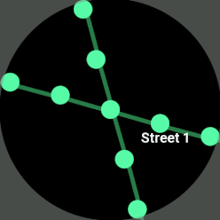
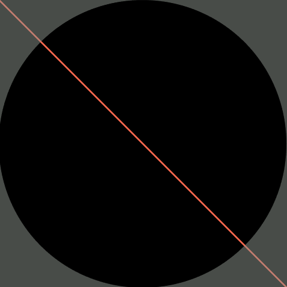
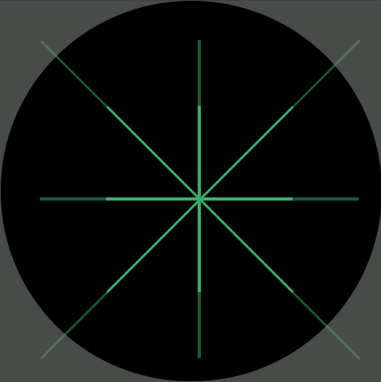
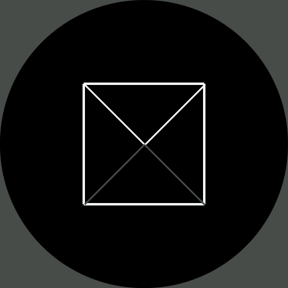
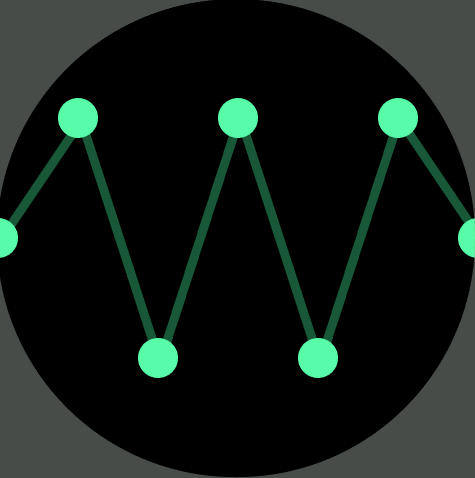
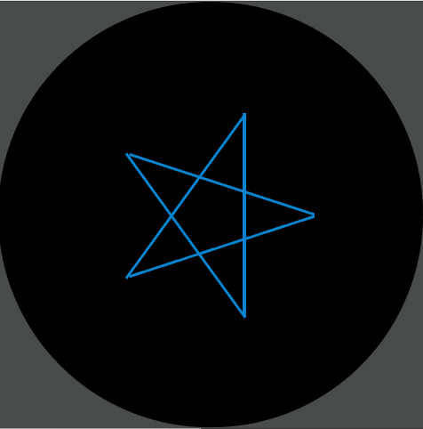
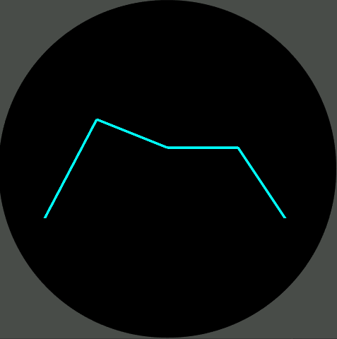

# Draw: Extended Widgets (Experimental) 
This library was mainly created to extend the main widgets and add functionality to `draw arbitrary lines` on `ZeppOS 2.0+`, which can currently be achieved only with a polyline widget. But that widget has its limitations - high memory consumption, very limited viewport of about 150px, all lines have to be the same color. In contrast, the `draw.line()` can essentially draw multicolor lines in any direction of hypothetically any reasonable length. This makes for a great tool to base your GPS apps on devices that don't support Canvas.



Under the hood the `line` method uses a `FILL_RECT` widget while applying some math `with various hacks and bug fixes` to it. The lines won't be pixel-perfect. This is an expected behavior and you'd have to apply workarounds where needed.

## Installation
Clone the repository then include `draw.js` in your project.

## Usage
Here is a very basic example of using `Draw`:

<br>

```js
import Draw from '../libs/draw';
const draw = new Draw();

// draw a line from (-200, -200) to (800, 800)
draw.line({x: -200, y: -200}, {x: 800, y: 800});
```

# More examples
## Example #1: Draw Lines From All Sides

<br>

```js
const color_dimmer_green = multiplyHexColor(COLOR_GREEN, 0.5);

draw.line({x: 50, y: 250}, {x: 450, y: 250}, { color: color_dimmer_green }); // H left to right
draw.line({x: 250, y: 50}, {x: 250, y: 450}, { color: color_dimmer_green }); // V top to bot
draw.line({x: 50, y: 50}, {x: 450, y: 450}, { color: color_dimmer_green });  // \ top-left to bot-right
draw.line({x: 450, y: 50}, {x: 50, y: 450}, { color: color_dimmer_green });  // / top-right to bot-left

// mirrored math
draw.line({x: 367, y: 250}, {x: 133, y: 250}, { color: COLOR_GREEN });   // H right to left
draw.line({x: 250, y: 367}, {x: 250, y: 133}, { color: COLOR_GREEN });  // V bottom to top
draw.line({x: 133, y: 367}, {x: 367, y: 133}, { color: COLOR_GREEN });   // / bot-left to top-right
draw.line({x: 367, y: 367}, {x: 133, y: 133}, { color: COLOR_GREEN });   // \ bot-right to top-left
```

## Example #2: Draw Envelope
<br>

```js
// draw the square
let point_a = { x: 140, y: 140 };
let point_b = { x: 340, y: 140 };
let point_c = { x: 340, y: 340 };
let point_d = { x: 140, y: 340 };

draw.line(point_a, point_b, { color: COLOR_WHITE });
draw.line(point_b, point_c, { color: COLOR_WHITE });
draw.line(point_c, point_d, { color: COLOR_WHITE });
draw.line(point_d, point_a, { color: COLOR_WHITE });

// draw the top triangle
let point_e = { x: 240, y: 240 };
let point_f = { x: 140, y: 140 };
let point_g = { x: 340, y: 140 };

draw.line(point_e, point_f, { color: COLOR_WHITE });
draw.line(point_e, point_g, { color: COLOR_WHITE });

// draw the bottom triangle using a slightly dimmer color
let point_h = { x: 240, y: 240 };
let point_i = { x: 140, y: 340 };
let point_j = { x: 340, y: 340 };

const color_dimmer_white = multiplyHexColor(COLOR_WHITE, 0.3);
draw.line(point_h, point_i, { color: color_dimmer_white });
draw.line(point_h, point_j, { color: color_dimmer_white });
```

## Example #3: Draw Wave
<br>

```js
// map
const points_arr = [
  {x: 0, y: 240},
  {x: 80, y: 120},
  {x: 160, y: 360},
  {x: 240, y: 120},
  {x: 320, y: 360},
  {x: 400, y: 120},
  {x: 480, y: 240}
];

// draw the circles and lines
for (let i = 0; i < points_arr.length; i++) {
    if (i < points_arr.length - 1) {
      draw.line(points_arr[i], points_arr[i + 1], { width: 10, color: multiplyHexColor(COLOR_GREEN, 0.5) });
    }

    // small shift in pixels to better position the cirles
    const right_shift = 2;

    // make sure circles are drawn on top of the lines
    draw.circle(points_arr[i].x + right_shift, points_arr[i].y, { radius: 20, color: multiplyHexColor(COLOR_GREEN, 1.5) });
}
```

## Example #4: Draw Star
<br>

```js
let center = { x: 240, y: 240 };
let radius = 120;
let points = 5;

const angle_step = (Math.PI * 2) / points;

for (let i = 0; i < points; i++) {
  let angle = angle_step * i;
  let outer_point = {
    x: center.x + radius * Math.cos(angle),
    y: center.y + radius * Math.sin(angle)
  };

  let next_angle = angle_step * ((i + 2) % points);
  let inner_point = {
    x: center.x + radius * Math.cos(next_angle),
    y: center.y + radius * Math.sin(next_angle)
  };

  draw.line(outer_point, inner_point, { line_fix: true, color: COLOR_BLUE });
}
```

## Example #5: Draw Polyline
<br>

#### Note: While this looks exactly like in the original `POLYLINE` example, `draw.polyline` can extend beyond the device's screen dimensions.
```js
const polypoints_arr = [
  { x: 0, y: 200 },
  { x: 100, y: 10 },
  { x: 200, y: 50 },
  { x: 300, y: 50 },
  { x: 400, y: 200 }
];
const params = { color: 0x00ffff, width: 4, y: 160, x: 40 }

const poly = draw.polyline(polypoints_arr, params);
```

## Example #6: Draw Map

#### Note: This example requires additional logic that you can find in the attached example. Also, it uses the `group` parameter which is a handy way of attaching any widget to a `GROUP_WIDGET` called `group` in this example. This way all the widgets are moving together with the whole canvas.
```js
const center = 240;
const map_size = 2048;

// define the number of points and the amplitude of the wave
const num_points = Math.floor(map_size / 100);
const amplitude = 100;

// calculate the distance between points
const dx = map_size / (num_points - 1);

// create an array to store the points for each direction
let points_arr = [[], [], [], []];

// generate the points in a wave pattern for each direction
for (let i = -num_points / 2; i <= num_points / 2; i++) {
  const x = center + i * dx;
  const y = center + amplitude * Math.sin(2 * Math.PI * i / num_points);
  
  // ensure there's at least 100px between each point
  if (i % Math.round(100 / dx) === 0) {
    points_arr[0].push({x: x, y: y}); // right
    points_arr[1].push({x: y, y: x}); // down
    points_arr[2].push({x: -x, y: -y}); // left
    points_arr[3].push({x: -y, y: -x}); // up
  }
}

// connect the points with lines to form the subway-like routes in each direction
for (let j = 0; j < points_arr.length; j++) {
  for (let i = 0; i < points_arr[j].length - 1; i++) {
    draw.line(points_arr[j][i], points_arr[j][i + 1], { width: 10, color: multiplyHexColor(COLOR_GREEN, 0.7), group: group });
  }
}

// draw a circle at each point and add street names every 10 intersections
for (let j = 0; j < points_arr.length; j++) {
  for (let i = 0; i < points_arr[j].length; i++) {
    draw.circle(points_arr[j][i].x, points_arr[j][i].y, { radius: 20, color: multiplyHexColor(COLOR_GREEN, 1.5), group: group });

    if (i % 10 === 0) {
      let street_name = "Street " + (i / 10);
      draw.text(street_name, { x: points_arr[j][i].x, y: points_arr[j][i].y, group: group });
    }
  }
}
```  
    

